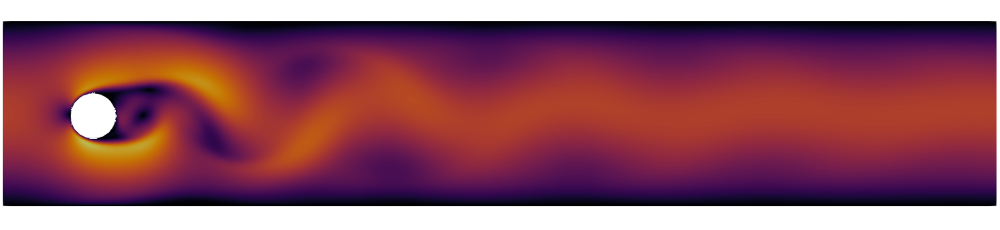

# UNSTEADY-INCOMPRESSIBLE-NAVIER-STOKES in 2D and 3D
This project aims to solve the unsteady, incompressible Navier-Stokes equations using the finite element method. The focus is on simulating the benchmark problem "**Flow past a Cylinder**" in two and three dimensions.

## Strong formulation
$$ \begin{cases} 
\frac{\partial \mathbf{u}}{\partial t} + (\mathbf{u} \cdot \nabla) \mathbf{u} - \nu \Delta \mathbf{u} + \nabla p = \mathbf{f} & \text{in } \Omega \, \\ 
\nabla \cdot \mathbf{u} = 0 & \text{in } \Omega \,\\ 
\mathbf{u} = \mathbf{g} & \text{on } \Gamma_{\mathrm{D}} \subset \partial \Omega \, \\ 
\nu \nabla \mathbf{u} \, \mathbf{n} - p \mathbf{n} = \mathbf{h} & \text{on } \Gamma_{\mathrm{N}} = \partial \Omega \backslash \Gamma_{\mathrm{D}} \,\\ 
\mathbf{u}(t=0) = \mathbf{u}_0 & \text{in } \Omega \, . 
\end{cases} $$

### COMPILE AND RUN
To compile and run the project these are the steps that need to be followed:

+ create and move inside build:  `mkdir build` `cd build`
+ load the dealii modules:  `module load gcc-glibc dealii`
+ build:  `cmake ..` `make`
+ run:
  - 2D Flow past a cylinder  -> `./navier_stokes2D`
  - 3D Flow past a cylinder  -> `./navier_stokes3D`
  - 3D Ethier-Steinmann cube -> `./convergence`

Output are saved in the _/build/output_ directory
